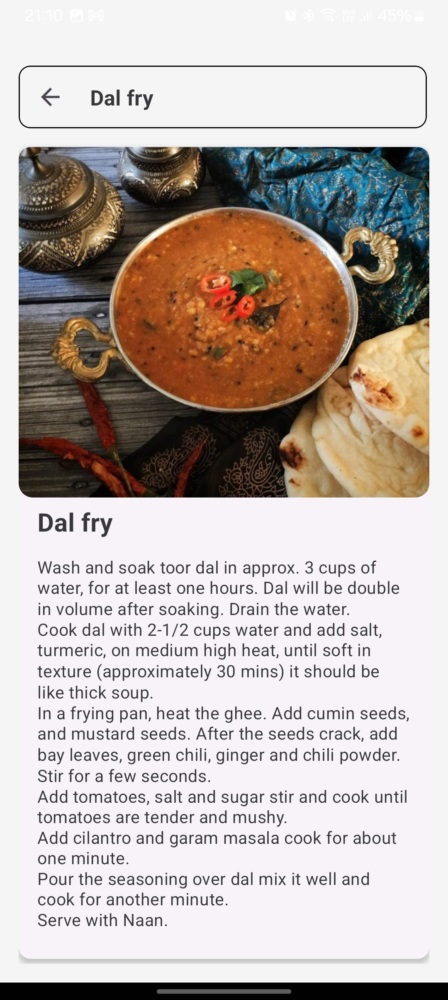

# RecipeBook App

This is a mobile application built using **React Native** and **Expo** that allows users to browse, search, select a meal or a recipe to follow it also provides the cooking instructions inlcuding the ingredients and you can also sort depending upon the meat or veg. The app interacts with a mwalDB API to provide functionality, making it an excellent tool for understanding Recipe Book application.

## Features

- **User-Friendly Interface**: A clean and intuitive UI that allows users to navigate through upcoming events effortlessly.
- **Random Meal**: This app also contains a random meal feature where it suggesta you a random meal.
- **Search Functionality**: Easily find meals by searching with keywords, main ingredients ,based on type of meal etc.
- **Meal Details**: Click on any meal to see detailed information with ingredients and instructions to follow.
- **MealDB API Integration**: The app uses a mealDB API to fetch meal data, allowing for realistic interaction without the need for a backend setup.

## Demo

Here are some screenshots of the app in action:

| Select By Variety Screen                                      | Meal Details                                      | Meal Search Screen                                      |
| ------------------------------------------------ | ------------------------------------------------- | --------------------------------------------------- |
|          |        |        |

## Download the APK

You can download the APK for this app from the following link:

- [Download APK](https://expo.dev/accounts/the_judgernautt_10/projects/mealdb-expo-app/builds/2135737e-0a75-4680-8e76-ab3179efc9cb)  


## Tech Stack

**Client:** ReactNative, 

**Server:** MealDB API,Appwrite Database


## Additional Features

- Signup Screen
- Settings Screen
- Find Restaurants Nearby 


## API Reference

#### Get all items
link to mock api:

```http
  GET https://www.themealdb.com/api.php
```

| Parameter | Type     | Description                |
| :-------- | :------- | :------------------------- |
| `api_key` | `string` | . No API key Required|


## Run locally on your Expo CLI

Clone the project

```bash
  git clone https://github.com/Sama2911arth/RecipeBook-A-app-made_using-Reactnative-and-MealDB-Api-and-AppWrite.git
```

Go to the project directory

```bash
  cd RecipeBook-A-app-made_using-Reactnative-and-MealDB-Api-and-AppWrite
 
```

Install dependencies

```bash
  npm install
```

Start the server

```bash
  npm start
```


## Documentation

[Documentation](https://docs.expo.dev/)

